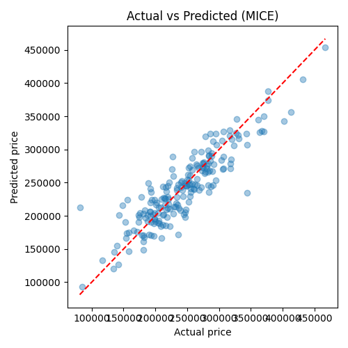
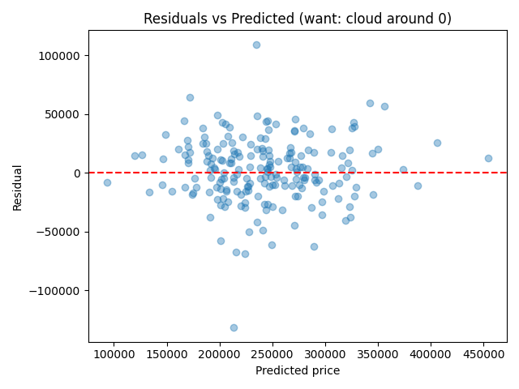
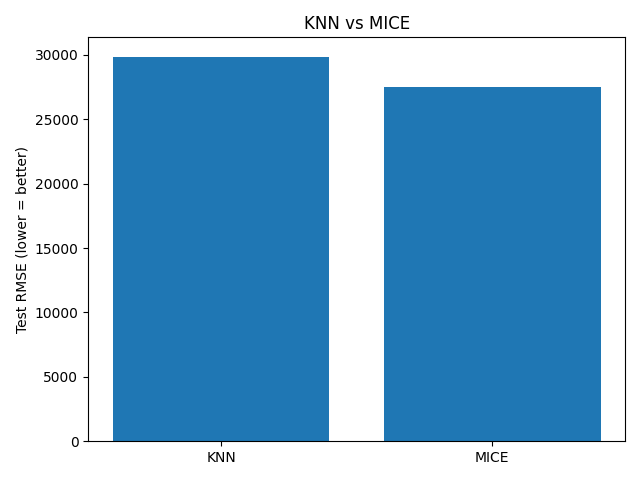

# Tutorial: Linear Regression + Feature Engineering (readable version)

> **Read this, run [`linear_regression_tutorial.py`](linear_regression_tutorial.py).**
> The `.py` file is the executable version of exactly what follows — same data,
> same pipelines, same outputs. Run it with:
>
> ```bash
> pip install scikit-learn pandas numpy matplotlib
> python linear_regression_tutorial.py
> ```

## Part 0 — What is Linear Regression?

The model is simple:

```text
y = w0 + w1·x1 + w2·x2 + … + wp·xp + error
```

We choose the weights `w` to minimize the **Mean Squared Error**:

```text
MSE = (1/n) · Σ (y_true − y_pred)²
```

`LinearRegression()` in scikit-learn solves this directly (SVD — no learning
rate to tune). Its assumptions are worth knowing:

1. Roughly linear relationship between features and target,
2. Errors have ~zero mean and constant variance,
3. Features aren't perfectly collinear,
4. No extreme outlier leverage.

The key insight for this tutorial: **a linear model can only learn linear
patterns in the feature space you give it.** Encoding, scaling, creating, and
selecting features is how you give it a fair chance — that's the whole
feature-engineering pipeline below.

## Part 1 — The dataset (synthetic housing, with missing values)

We generate 1,000 houses so the tutorial needs no downloads:

| Feature | Type | Notes |
|---|---|---|
| `size_sqft`, `num_rooms`, `age_years`, `dist_center_km` | numeric | 8–12% missing (MCAR) |
| `neighborhood`, `house_style` | categorical | `house_style` 7% missing |
| `price` | target | hidden linear formula + noise |

```python
X = df.drop(columns="price")
y = df["price"]
X_train, X_test, y_train, y_test = train_test_split(X, y, test_size=0.2, random_state=42)
```

## Part 2 — Encoding: turn text into numbers

- **`OneHotEncoder`** — one 0/1 column per category. Use for **nominal**
  variables like `neighborhood` (no ordering). Always pass
  `handle_unknown="ignore"` so unseen test categories don't crash the pipeline.
- **`OrdinalEncoder`** — maps to 0, 1, 2… Use **only** for ordered variables
  (e.g. apartment < semi-detached < detached).
- ⚠️ Never use `LabelEncoder` on features — it's for the target `y` only.

## Part 3 — Scaling: why it matters here

`LinearRegression` itself doesn't *require* scaling, but you want it when:

1. **Comparing coefficients** — unscaled, the `size_sqft` coefficient looks tiny
   next to `num_rooms` purely because of units.
2. **Using regularization (Ridge/Lasso) or distance-based steps
   (`KNNImputer`)** — distances are dominated by the largest-scale feature.

| Scaler | Formula | When |
|---|---|---|
| `StandardScaler` (default) | (x − mean) / std → zero mean, unit variance | General choice |
| `MinMaxScaler` | (x − min) / (max − min) → [0, 1] | Bounded/neural-net inputs; sensitive to outliers |

Golden rule: **fit the scaler on train only** — inside a `Pipeline` this is
automatic, which is exactly why we build pipelines instead of manual steps.

## Part 4 — Feature creation: give a linear model non-linear power

- **A. Domain features** via `FunctionTransformer`, e.g.
  `size_per_room = size_sqft / num_rooms` — plugs a plain DataFrame function
  into the pipeline.
- **B. `PolynomialFeatures(degree=2)`** — auto-generates `x₁²`, `x₁·x₂`, …
  `LinearRegression` on these *is* polynomial regression (still linear in the
  *weights*). In our pipeline 4 numeric columns become 14.

Ordering rule: create **after** imputation (else NaN propagates), **before**
scaling (so the scaler normalizes the new features too).

## Part 5 — Feature selection: fewer, better features

Why: less overfitting, faster training, interpretable coefficients.

- **`VarianceThreshold`** — drops near-constant columns (e.g. a broken sensor).
- **`SelectKBest(f_regression, k=15)`** — keeps the K features most correlated
  with `y` (F-test). Simple, fast, pairs well with LinearRegression.

⚠️ Always select **inside** the CV pipeline (fit on train folds only) to avoid
leakage — automatic when it's a `Pipeline` step.

## Part 6 — Imputation showdown: KNN vs MICE

- **`KNNImputer`** — fills each NaN with the mean of its K nearest complete
  rows. Simple, local, fast. Sensitive to scale → scale first.
- **`IterativeImputer` (MICE)** — cycles through columns, regressing each
  missing column on all others. Global, model-based; stronger on correlated
  numerics, slower.

Fair comparison: two pipelines **identical except the numeric imputer**, same
5-fold CV, same held-out test set:

```python
Pipeline([
    ("prep", ColumnTransformer([
        ("num", Pipeline([
            ("impute", KNNImputer() | IterativeImputer()),  # <-- only swap
            ("poly", PolynomialFeatures(degree=2, include_bias=False)),
            ("scale", StandardScaler()),
        ]), numeric_features),
        ("cat", Pipeline([
            ("impute", SimpleImputer(strategy="most_frequent")),
            ("onehot", OneHotEncoder(handle_unknown="ignore")),
        ]), categorical_features),
    ])),
    ("select", SelectKBest(f_regression, k=15)),
    ("model", LinearRegression()),
])
```

Results (typical run, 1,000 samples, ~10% missingness):

| Pipeline | CV RMSE | CV R² | Test RMSE | Test R² |
|---|---|---|---|---|
| KNN (k=5) | 25,553 | 0.829 | 29,861 | 0.765 |
| MICE | 24,862 | 0.838 | 27,530 | 0.800 |

Rule of thumb: **KNN = fast local baseline; MICE = stronger when numerics are
correlated, at the cost of fit time.** (Tired of choosing by hand? That's what
[`imputer_advisor.py`](imputer_advisor.py) automates — see
[`ARCHITECTURE.md`](ARCHITECTURE.md).)

## Part 7 — Final model: diagnose and interpret

The script refits the winner on the full train set and reports test
**RMSE / MAE / R²**, the top coefficients by |magnitude| in standardized space
(`size_sqft`, coastal/downtown neighborhoods, and `detached` style dominate —
matching the hidden formula), plus three diagnostic plots:





## Exercises

1. Swap `StandardScaler` → `MinMaxScaler`. Does test RMSE change? Why / why not?
2. Try `k=5` vs `k=30` in `SelectKBest`. Watch CV R² for overfitting.
3. Replace `LinearRegression` with `Ridge(alpha=1.0)`. When does it win?
4. Try `RobustScaler` on the outlier-heavy `age` / `dist` columns and compare.

## Where to go next

- Automate the Part 6 decision: [`imputer_advisor.py`](imputer_advisor.py) + [`ARCHITECTURE.md`](ARCHITECTURE.md)
- See it validated: [`BENCHMARK_RESULTS.md`](BENCHMARK_RESULTS.md)
- Click through it: [`USER_GUIDE.md`](USER_GUIDE.md)
