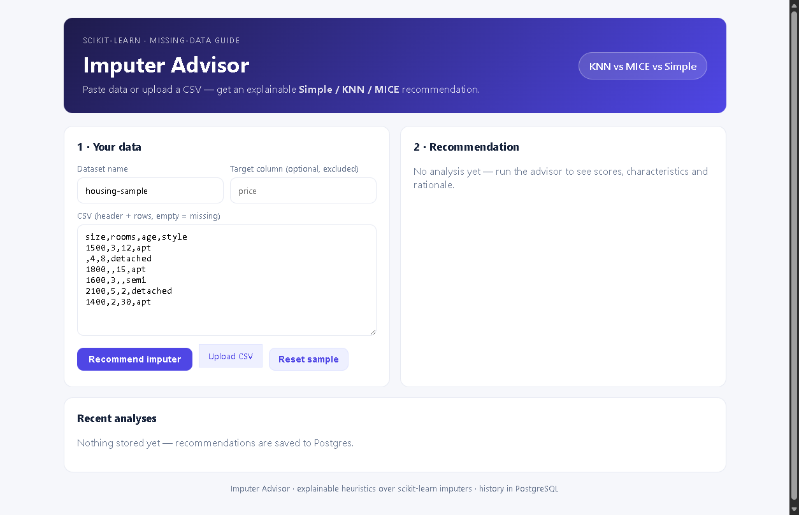
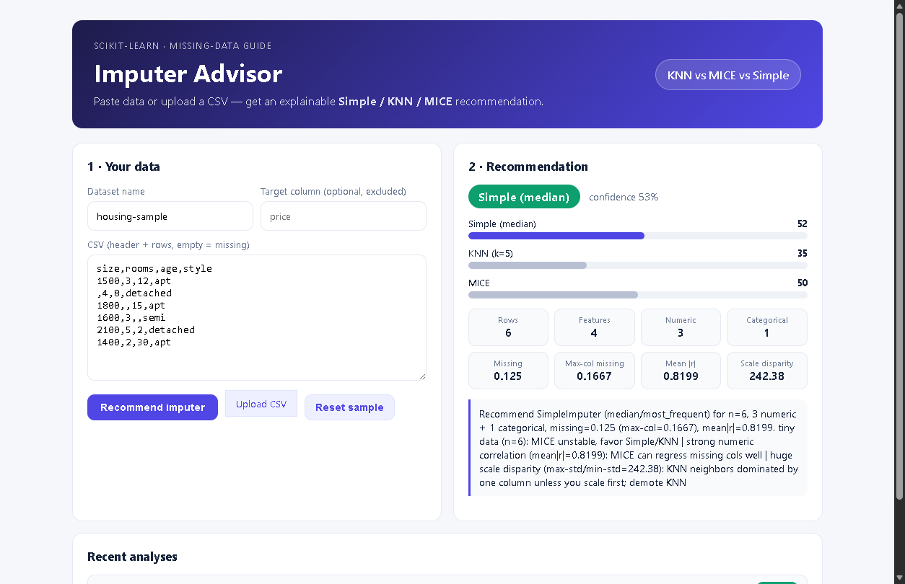
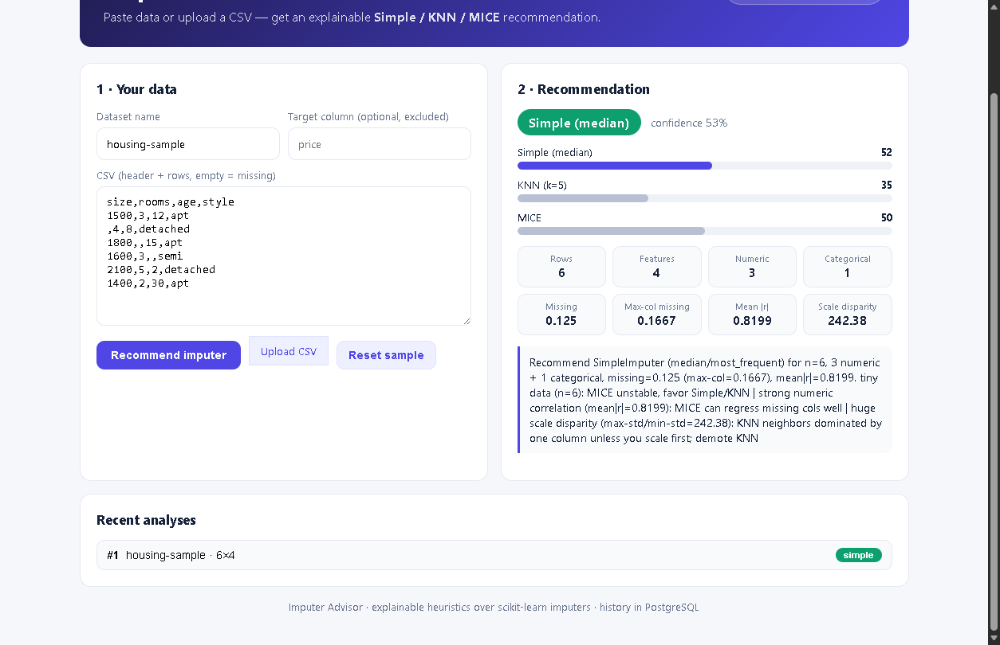
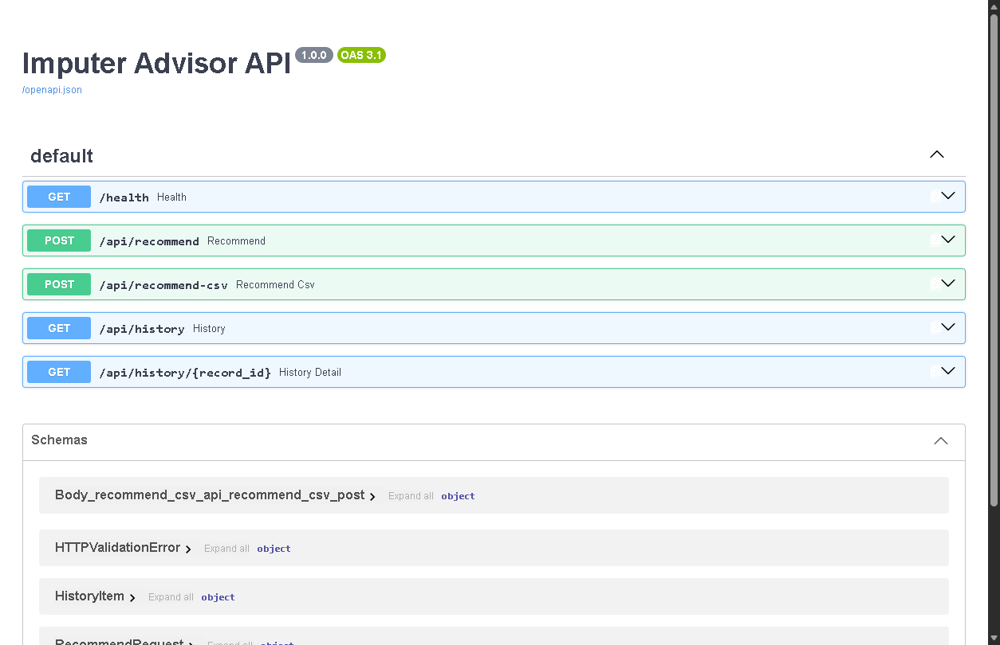

# User Guide — Imputer Advisor

> Which imputer should you use — Simple, KNN, or MICE? Paste your data, get an
> explainable recommendation in seconds.

## 1. What this project gives you

| Piece | File / folder | Use it when… |
|---|---|---|
| **Quickstart tutorial** | `linear_regression_tutorial.py` | You're learning: 10-minute Linear Regression + feature engineering walkthrough |
| **Advisor (Python)** | `imputer_advisor.py` | You want the recommendation inside your own script or pipeline |
| **Advisor (web UI)** | `frontend/` + `backend/` | You want to paste/upload a CSV and click a button |
| **Benchmark proof** | `BENCHMARK_RESULTS.md` | You want to see the advisor validated on 4 datasets (4/4 hits) |
| **Deploy** | `docker-compose.yml`, `k8s/` | You want to run it for a team |

## 2. Prerequisites

- **Easiest path:** Docker Desktop (Compose v2) — no Python/Node needed.
- **Local-dev path:** Python 3.10+ and Node 18+.

## 3. Run it with Docker (recommended)

```powershell
Copy-Item .env.example .env
# optional: set a real POSTGRES_PASSWORD inside .env
docker compose up --build
```

Open these in your browser:

- **App:** http://localhost:8080
- **API health:** http://localhost:8000/health → `{"status":"ok"}`
- **Interactive API docs:** http://localhost:8000/docs

## 4. Your first recommendation (web UI, 2 minutes)

1. Open http://localhost:8080. The form comes pre-filled with a housing sample.

   

2. Click **Recommend imputer**. You'll get a verdict pill (e.g. `MICE`), a
   confidence %, score bars for all three imputers, your data's characteristics
   (rows, missing rate, mean |correlation|, scale disparity…), and a plain-English
   rationale.

   

3. **Reading the result:**
   - *High confidence (≥ 0.75)* — the data clearly favors one imputer. Go with it.
   - *Low confidence (~0.55)* — two imputers are near-tied (common when columns
     barely correlate). Either is defensible; Simple is the cheapest.
   - *The rationale sentence is the audit trail* — it tells you which data
     characteristics drove the call. If you disagree with one, you can override
     the recommendation intelligently.
4. Try your own data: paste CSV (header + rows, leave cells empty for missing)
   or use **Upload CSV**. If one column is your prediction target, type its name
   in **Target column** so it's excluded from the analysis.
5. Every analysis is saved. Scroll to **Recent analyses** and click any entry to
   reopen it.

   

## 5. Use it from Python (no servers)

```powershell
pip install scikit-learn pandas numpy
```

```python
import pandas as pd
from imputer_advisor import recommend_imputer, ImputerAdvisor

df = pd.read_csv("my_data.csv")

rec = recommend_imputer(df)
print(rec["recommended"], rec["confidence"])
print(rec["rationale"])

clean = ImputerAdvisor().fit_transform(df)  # drop-in cleaning step, no NaNs left
```

## 6. Use it as an API

Interactive docs with Try-it-out buttons: http://localhost:8000/docs



```powershell
# JSON payload
curl -X POST http://localhost:8000/api/recommend `
  -H "Content-Type: application/json" `
  -d '{"dataset_name":"housing","columns":["size","rooms","style"],"rows":[[1500,3,"apt"],[null,4,"detached"],[1800,null,null]]}'

# CSV file upload
curl -X POST "http://localhost:8000/api/recommend-csv?dataset_name=housing" `
  -F "file=@my_data.csv"

# History
curl http://localhost:8000/api/history
```

## 7. Learn & verify (tutorial, tests, benchmark)

```powershell
pip install scikit-learn pandas numpy matplotlib
python linear_regression_tutorial.py  # quickstart: prints metrics, saves 3 PNG plots
python test_imputer_advisor.py        # 7 tests, no pytest needed
python benchmark_imputers.py          # reproduces benchmark_results.json (4 datasets)
```

## 8. Deploy for a team

- **Compose** (above) already runs Postgres + API + UI with one command.
- **Kubernetes:** `kubectl apply -f k8s/` (namespace, Postgres + PVC, backend ×2,
  frontend ×2, ingress on `advisor.local`). Build/push the images to your
  registry first and replace the demo values in `k8s/postgres-secret.yaml`.

## 9. Troubleshooting

| Symptom | Fix |
|---|---|
| UI shows a red warning on Analyze | Backend isn't reachable — check `docker compose ps`; backend must be up on :8000 |
| `docker compose up` fails on `db` | Port 5432 taken, or stale volume — `docker compose down -v`, then `up` again |
| UI looks stale after editing `frontend/` | Rebuild: `docker compose up --build frontend` |
| `IterativeImputer` ImportError in own scripts | Add `from sklearn.experimental import enable_iterative_imputer` first (see README) |
| MICE is slow on big data | Expected (~5–10× Simple/KNN). On weakly-correlated data, Simple is the pragmatic pick |

## 10. FAQ

- **Is the recommendation an AI model?** No — transparent heuristic rules over
  measured data characteristics (see `ARCHITECTURE.md`). A learned meta-model is
  on the `ROADMAP.md`, gated behind collecting more benchmark datasets first.
- **Do you store my data?** The API stores characteristics + scores + rationale
  in Postgres history, not your raw rows (JSON endpoint) — only the CSV filename
  for uploads. The Python path stores nothing.
- **KNN or MICE, in one line?** Correlated numerics at similar scales → MICE;
  local/clustered structure → KNN; extreme missingness or tiny data → Simple.
